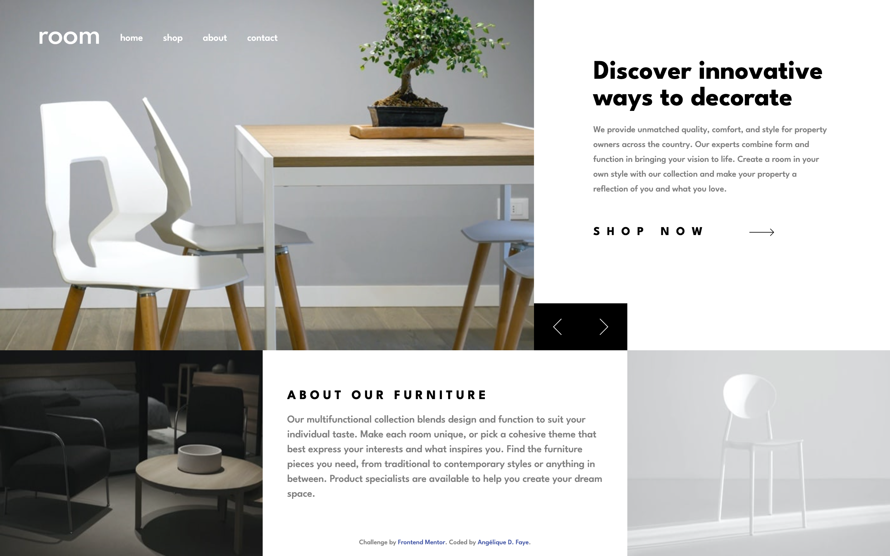

# Room e-commerce homepage.




<div align="center">
  
  
  
</div>

## Overview

_The homepage for a design studio!_

<br />

## Links

<p>
<a href="https://github.com/AngeliqueDF/room-ecommerce-homepage">GitHub repo</a> • <a href="https://room-ecommerce-homepage.vercel.app/">Live demo </a>
</p>

<br />

## How to run the project

1. `git clone https://github.com/AngeliqueDF/room-ecommerce-homepage MY_FOLDER_NAME`
2. `cd MY_FOLDER_NAME`
3. `npm install`
4. `npm start`
5. visit `http://localhost:1234`

<br />

## Features

- Responsiveness
- Carousel
- Accessibility

## Technologies

- Semantic HTML5
- CSS3
- ES6

<br />

## Description

This is a frontend challenge. Aside from the HTML structure and page layout, I had to implement a carousel feature. For that, I chose not to use an external library but to leverage CSS as much as possible.

> ## The challenge
>
> Your challenge is to build out this e-commerce homepage and get it looking as close to the design as possible.
>
> You can use any tools you like to help you complete the challenge. So if you've got something you'd like to practice, feel free to give it a go.
>
> Your users should be able to:
>
> - View the optimal layout for the site depending on their device's screen size
> - See hover states for all interactive elements on the page
> - Navigate the slider using either their mouse/trackpad or keyboard

### How I built this project

1. Frontend
   1. Start by structuring the page with semantic and accessible HTML. Check W3C compliance with the website or extension.
   2. Style the page with a mobile-first approach.
   3. Add functionality with minimal JavaScript.

### What I learned

The new part for me was using `scroll-*` with `overflow-x` rules to achieve the slider functionality:

```css
/* Slider */
.slider-cta ul {
	/* position .slide elements in a row */
	display: grid;
	grid-template-rows: 1fr;
	grid-template-columns: repeat(3, 100vw);
	/* allow users to scroll horizontally */
	overflow-x: scroll;
	/* enforce snap points */
	scroll-snap-type: x mandatory;
}
.slider-cta ul li {
	width: 100vw;
	overflow-y: hidden;
	/* snap scroll at the start of the block an main axes */
	scroll-snap-align: start;
}
```

### Recommended technologies and tools

<br />

### Sources

- [Room homepage challenge by Frontend Mentor.](https://www.frontendmentor.io/challenges/room-homepage-BtdBY_ENq)

### Planned changes

- [x] Add accessibility features.
